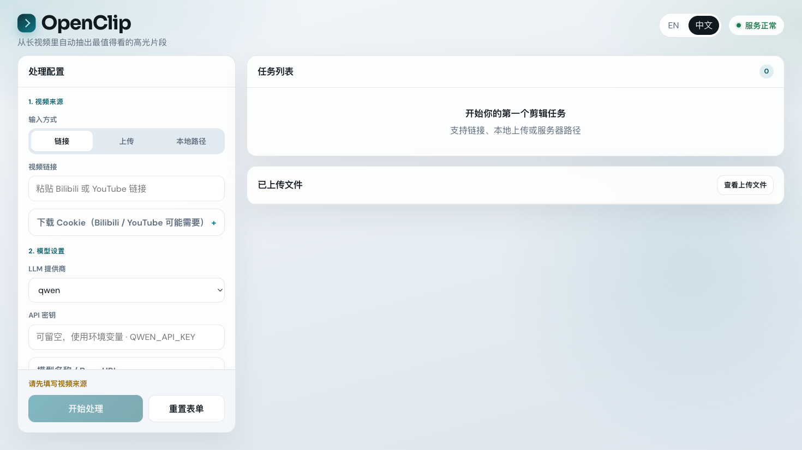
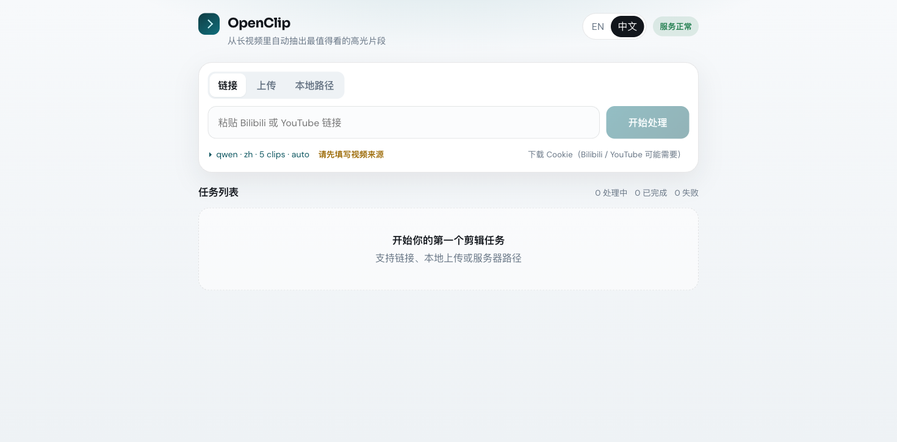
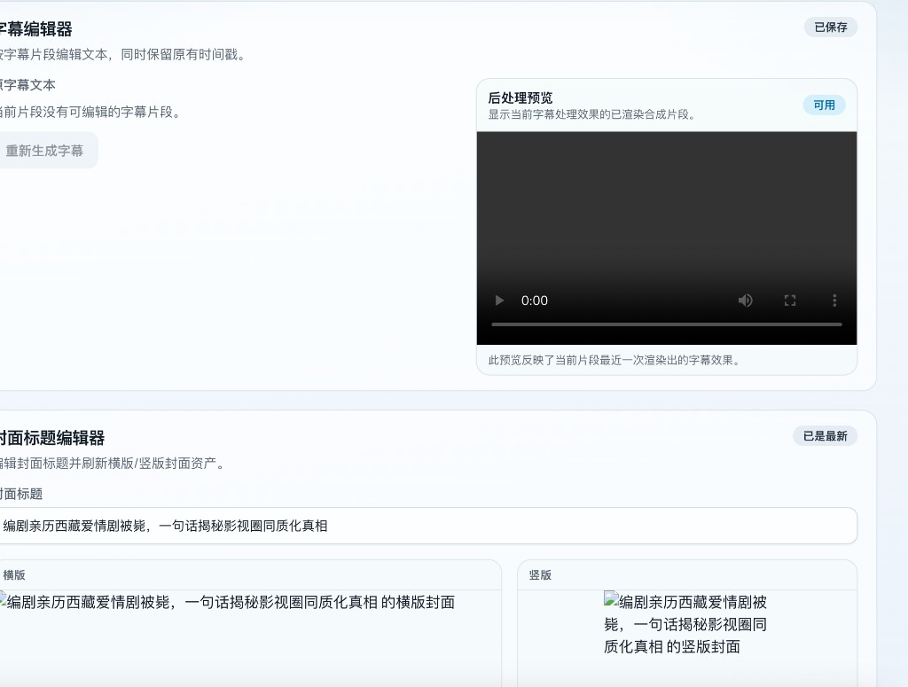

<p align="center">
  
</p>


[English](./README_EN.md) | 简体中文

OpenClip 是一个轻量化的 AI 视频高光提取工具。输入长视频（口播、直播回放、访谈等），自动完成 **下载 → 转录 → AI 分析 → 剪辑 → 封面**，并在 **Web 导播台** 里管理任务、预览结果、进入 **Clip Editor** 做二次精修。

> 💡 与 [AutoClip](https://github.com/zhouxiaoka/autoclip) 的区别？见文末[对比说明](#-与-autoclip-的对比)。

## 📢 最新动态

- **2026-07-15 — Web 导播台（默认界面）**
  - 全新 **React Web UI**（`web_api.py` + `web_frontend/`），默认端口 **8502**
  - 单页完成：创建任务 → 看进度 → 看结果 → **打开编辑器**（无需单独起 editor 服务）
  - 支持 **链接 / 本地上传 / 服务器路径** 三种输入；Cookies 文件可在页面直接上传
  - 处理偏好写入 `data/openclip.db`；任务历史写入 `jobs/*.json`
  - **Docker Compose** 一键部署（镜像自带带 libass 的 ffmpeg）
- 更早更新见 [CHANGELOG 摘要](#更早更新)

## 🎬 演示

### Web 导播台

主页：左侧处理配置 + 右侧任务列表与上传管理。



处理设置展开（LLM、片段参数、Cookie、字幕样式等）：



### Clip Editor

任务完成后在同一 Web 应用内打开编辑器，调整字幕、封面与预览成片：



## ✨ 核心能力

| 能力 | 说明 |
|------|------|
| **Web 导播台** | 任务卡片、实时进度、结果预览、重试/取消/删除 |
| **三种输入** | Bilibili / YouTube 链接、浏览器上传、服务器本地路径 |
| **智能转录** | 优先平台字幕；本地 ASR 按语言路由（英文 faster-whisper，中文可选 Paraformer） |
| **AI 高光** | 识别口播/直播中的精彩片段；支持 **User Focus** 自然语言引导 |
| **深度优化** | 可选二次 AI 复审与边界修正（Web UI「深度优化」/ CLI `--deep-optimize`） |
| **Clip Editor** | 调整片段边界、编辑字幕、改封面标题、倍速重渲染 |
| **字幕烧录** | 可选硬字幕 + 双语翻译（Docker 镜像 / Debian ffmpeg 自带 libass） |
| **封面生成** | 横版 + 竖版封面图 |
| **后台任务** | 多任务并发；服务重启后中断任务标记为失败，可重试 |
| **CLI / Agent** | `video_orchestrator.py` 与 Agent Skill 仍可用 |

## 🚀 快速开始

### Docker（推荐）

```bash
git clone https://github.com/linzzzzzz/openclip.git
cd openclip

cp .env.example .env
# 编辑 .env，至少填写一组 LLM API Key（如 QWEN_API_KEY）

docker compose up -d --build
# 打开 http://127.0.0.1:8502/
```

**持久化目录**

| 路径 | 内容 |
|------|------|
| `./jobs/` | 任务记录（每个任务一个 JSON） |
| `./processed_videos/` | 下载、分析、剪辑、编辑器 manifest |
| `./data/` | 用户偏好（SQLite） |
| Docker volume `openclip-cache` | Whisper / HuggingFace 模型缓存 |

默认时区 `Asia/Shanghai`，可在 `.env` 设置 `TZ=...`。构建慢时可使用 `APT_MIRROR=mirrors.aliyun.com docker compose build --no-cache`。

> 默认镜像不含 Paraformer / WhisperX 等重量级 extra。需要时在本地 `uv sync --extra …` 运行，或自行扩展 Dockerfile。

### 本地开发

```bash
git clone https://github.com/linzzzzzz/openclip.git
cd openclip

uv sync
cd web_frontend && npm install && npm run build && cd ..

export QWEN_API_KEY=your_key   # 或其他提供商，见下文
uv run python web_api.py
# http://127.0.0.1:8502
```

UI 热更新开发：

```bash
# 终端 1
uv run python web_api.py

# 终端 2
cd web_frontend && npm run dev
```

<a id="paraformer-installation"></a>
<details>
<summary>🈶 启用 Paraformer 中文本地 ASR（可选）</summary>

```bash
uv sync --extra paraformer
```

中文音频会优先走 Paraformer；依赖不可用时自动回退 faster-whisper。默认 helper 位于 `third_party/funasr-paraformer`。

</details>

## 🖥️ Web 导播台使用指南

### 1. 选择视频来源

| 模式 | 适用场景 |
|------|----------|
| **链接** | Bilibili / YouTube URL；可配置 Cookie 模式 |
| **上传** | 浏览器选择本地 mp4/mov 等，文件暂存到 `processed_videos/_uploads/` |
| **服务器路径** | 后端机器上已有的绝对路径（Docker 内需是容器内路径） |

Bilibili 多 P 视频会自动拆成多个任务。

### 2. 处理设置

点击 **处理设置** 展开：

- **LLM 提供商 / API Key / 语言 / 最大片段数 / 时长预设**
- **User Focus**：用自然语言描述想找的片段（如「关于 AI 风险的观点」）
- **生成封面 / 烧录字幕 / 深度优化 / 艺术标题 / 强制 Whisper / 背景信息**
- **Cookie 模式**（仅链接）：不使用 → 浏览器 Cookie → **上传 cookies.txt**
- **字幕样式**（开启烧录后）：预设、字号、位置、翻译语言，可实时预览
- **高级**：自定义模型与 Base URL、输出目录、说话人参考目录、自定义提示词

偏好会保存到 `data/openclip.db`，下次打开自动恢复。API Key 也可在浏览器 localStorage 中记住（按提供商分开）。

### 3. 任务列表

- 实时显示进度与当前步骤
- **已完成**：查看高光列表；若成功生成剪辑，显示 **打开编辑器**
- **失败 / 已取消**：重试（创建新任务，参数相同）
- **处理中 / 排队**：取消
- 任意状态可删除任务记录

> **何时没有「打开编辑器」？** 任务虽显示完成，但 AI 未找到高光（0 条）或剪辑生成失败时，不会有编辑器项目。常见于纯音乐/混剪、Whisper 字幕质量差、内容与口播高光模型不匹配的视频。可换素材、填写 User Focus，或检查 `processed_videos/.../splits/top_engaging_moments.json`。

### 4. Clip Editor（内嵌）

从任务卡片进入 `/editor/:projectId`，可：

- 调整片段 **起止时间** 与 **倍速**，触发边界重渲染
- 编辑 **字幕文本**（含翻译轨），重渲染字幕
- 修改 **封面标题**，重渲染封面
- 预览成片、封面横竖版

编辑器 manifest 位于各项目的 `editor_project.json`。Docker 与本机共用 `processed_videos` 时，路径会自动映射。

## 🍪 Cookie 使用建议

远程下载遇到登录/风控时，按顺序尝试：

1. **不使用 cookies**
2. **浏览器 cookies**（本机 uv 运行时有效；Docker 内通常不可用）
3. **Cookies 文件** — Web UI 可直接上传 Netscape 格式 `cookies.txt`

YouTube 使用 cookies 时建议安装 [Deno 或 Node](https://github.com/yt-dlp/yt-dlp/wiki/EJS#step-1-install-a-supported-javascript-runtime)。导出教程：[Exporting YouTube cookies](https://github.com/yt-dlp/yt-dlp/wiki/Extractors#exporting-youtube-cookies)

## 📋 前置要求

### 手动安装

- **[uv](https://docs.astral.sh/uv/getting-started/installation/)** — Python 包管理
- **FFmpeg** — 视频处理（macOS: `brew install ffmpeg`）
- **LLM API Key**（任选其一）：Qwen、OpenRouter、GLM、MiniMax、`custom_openai`
- **Chrome / Firefox / Edge / Safari**（可选）— 浏览器 Cookie 下载
- **Deno 或 Node**（可选）— YouTube 下载稳定性
- **HuggingFace Token**（可选）— 说话人识别 `uv sync --extra speakers`

<details>
<summary>需要双语字幕烧录？ffmpeg 需带 libass</summary>

- macOS: `brew tap homebrew-ffmpeg/ffmpeg && brew install homebrew-ffmpeg/ffmpeg/ffmpeg`
- Ubuntu: `sudo add-apt-repository ppa:savoury1/ffmpeg4 && sudo apt install ffmpeg`
- **Docker 镜像已包含 libass**，无需额外配置

</details>

### uv 自动安装

`uv sync` 会安装 Python 3.11+、yt-dlp、faster-whisper 等依赖。

可选 extra：

- `uv sync --extra paraformer` — 中文 Paraformer ASR
- `uv sync --extra speakers` — WhisperX 说话人识别

## 📁 输出结构

```
processed_videos/{video_name}/
├── downloads/           # 原视频与元数据
├── splits/              # 分片、转录、AI 分析 JSON
├── clips/               # 高光 mp4、srt、封面图
├── clips_post_processed/# 烧字幕 / 艺术标题后的成片
├── editor_project.json  # Clip Editor manifest
└── editor_overrides/    # 手动字幕等覆盖文件
```

## 🔧 处理流程

```text
输入（链接 / 上传 / 路径）
    ↓
下载或校验视频
    ↓
提取或生成字幕（平台字幕 → 本地 ASR）
    ↓
超长视频分片（>20 分钟）
    ↓
AI 分片分析 → 汇总 Top 高光
    ↓  （可选：深度优化 = 独立成段复审 + 边界修复）
生成剪辑 + 封面
    ↓  （可选：烧录字幕 / 艺术标题）
写入 editor_project.json
```

## 🛠️ 其他使用方式

### Streamlit（旧版界面）

仍可通过 Streamlit 使用，端口 **8501**：

```bash
uv run python -m streamlit run streamlit_app.py
```

新功能优先在 Web 导播台发布；Streamlit 适合已有工作流迁移前的过渡。

### 命令行

```bash
# Bilibili / YouTube / 本地文件
uv run python video_orchestrator.py "https://www.bilibili.com/video/BVxxxx"

# 常用参数示例
uv run python video_orchestrator.py \
  --user-intent "最有争议的观点" \
  --burn-subtitles \
  --subtitle-translation "Simplified Chinese" \
  --deep-optimize \
  "VIDEO_URL"
```

<details>
<summary>📖 完整 CLI 参数表</summary>

| 参数 | 说明 | 默认 |
|------|------|------|
| `VIDEO_URL_OR_PATH` | 视频 URL 或路径 | 必填 |
| `-o`, `--output` | 输出目录 | `processed_videos` |
| `--llm-provider` | qwen / openrouter / glm / minimax / custom_openai | qwen |
| `--llm-model` / `--llm-base-url` | 覆盖模型与接口 | 提供商默认 |
| `--language` | 输出语言 zh / en | zh |
| `--browser` / `--cookies` | Cookie 模式（CLI） | 无 |
| `--force-whisper` | 忽略平台字幕，强制本地 ASR | 关 |
| `--user-intent` | 自然语言关注点 | 无 |
| `--max-clips` | 最多片段数 | 5 |
| `--clip-length` | auto / 30_60 / 60_90 / 90_180 / 180_300 | auto |
| `--deep-optimize` | 深度优化（Web UI「深度优化」） | 关 |
| `--burn-subtitles` | 烧录字幕 | 关 |
| `--subtitle-translation` | 翻译后双语烧录 | 无 |
| `--add-titles` | 艺术标题 | 关 |
| `--speaker-references` | 说话人参考目录（extra speakers） | 无 |
| `--skip-download` / `--skip-clips` 等 | 跳过各阶段 | 关 |

Banner 标题风格：`fire_flame`（默认）、`gradient_3d`、`neon_glow`、`metallic_gold` 等，见 `video_orchestrator.py --help`。

</details>

### Agent Skills

在 Claude Code、Cursor、TRAE 等 Agent 中用自然语言处理视频：

```bash
npx skills add https://github.com/linzzzzzz/openclip --skill video-clip-extractor -g
```

技能定义：`.claude/skills/video-clip-extractor/`

<a id="speaker-identification"></a>
<details>
<summary>🎙️ 说话人识别（预览版）</summary>

```bash
uv sync --extra speakers
export HUGGINGFACE_TOKEN=hf_xxx

uv run python tools/extract_reference.py VIDEO 00:01:23 00:01:50 "references/Host.wav"
uv run python video_orchestrator.py --speaker-references references/ "VIDEO"
```

Web UI 高级设置中可填 `speaker_references_dir`（CLI 参数 `--speaker-references`）。

</details>

## 🎨 自定义

- **背景信息**：编辑 `prompts/background/background.md`，Web UI 开启「背景信息」或 CLI `--use-background`
- **分析提示词**：`prompts/engaging_moments_*.md`、`prompts/language_patches/`
- **User Focus**：Web UI 文本框或 `--user-intent`

## 🐛 故障排除

| 现象 | 可能原因 / 处理 |
|------|----------------|
| **0 条高光 / 无编辑器** | AI 认为无可剪片段；查 `splits/top_engaging_moments.json`。口播类内容效果最好；音乐/混剪常为空。填 User Focus 或换素材 |
| **Docker 编辑器缺字幕/封面** | 旧 manifest 含本机绝对路径；刷新页面或重新打开项目（已支持路径映射） |
| **Docker 看不到本地任务** | 确认挂载 `./jobs`；任务按浏览器 session 过滤 |
| **下载失败** | 更新 yt-dlp：`uv lock --upgrade-package yt-dlp && uv sync`；尝试 Cookie；YouTube 安装 Deno/Node |
| **字幕烧录失败** | 需要 libass；Docker 已带；本机 Homebrew ffmpeg 可能不含 ass 滤镜 |
| **中文乱码/繁体** | 安装 `fonts-noto-cjk`；中文建议 `uv sync --extra paraformer` |
| **LLM 报错** | 检查 API Key 与环境变量；custom_openai 需填 Base URL + Model |

## 🔄 与 AutoClip 的对比

| | OpenClip | AutoClip |
|---|----------|----------|
| 代码规模 | ~5K 行核心 | ~2M 行（含前端依赖） |
| 依赖 | Python + FFmpeg | Docker + Redis + PostgreSQL + Celery |
| 默认界面 | **React Web 导播台** | Web |
| 部署 | `docker compose up` 或 `uv sync` | Docker 全家桶 |
| 定制 | 可编辑 prompts | 配置文件 |

感谢 [AutoClip](https://github.com/zhouxiaoka/autoclip) 的启发。

## 更早更新

<details>
<summary>2026-05 ~ 2026-03 主要变更</summary>

- 片段时长预设（Auto / 30s-60s / … / 3m-5m）
- Clip Editor：边界、字幕、封面二次调整
- Streamlit 文件上传、多 P Bilibili、任务重试
- `--deep-optimize` 深度优化
- `custom_openai`、Paraformer 中文 ASR、GLM / MiniMax
- 字幕烧录、说话人识别（预览）、`--user-intent`
- Agent Skill 上架 skills.sh

</details>

## 🤝 贡献

欢迎 PR。优先保持 codebase 轻量可读：提示词改进、性能优化、更多平台支持等。

## 📞 支持

1. 查看任务步骤与 `docker compose logs -f openclip`
2. 先用短视频验证
3. [GitHub Issues](https://github.com/linzzzzzz/openclip/issues)
4. [Discord 社区](https://discord.gg/KsC4Keaq)

## 📄 许可证

MIT — 详见 [LICENSE](LICENSE)
